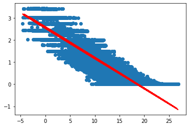
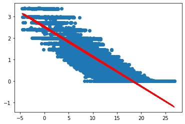
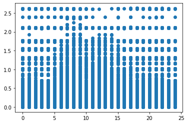
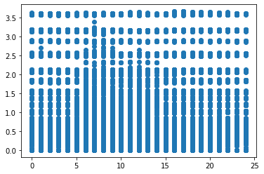
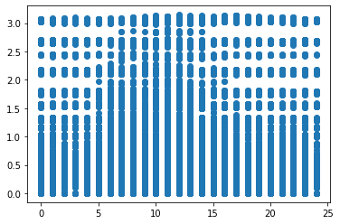
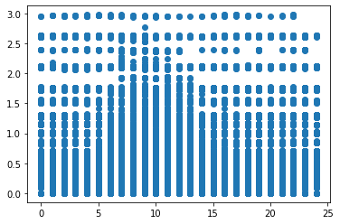

```python
import pandas as pd
import numpy as np
from sklearn.cluster import KMeans
from sklearn.preprocessing import LabelEncoder
from sklearn.preprocessing import MinMaxScaler
import seaborn as sns
import matplotlib.pyplot as plt
from sklearn.tree import DecisionTreeClassifier
from sklearn import metrics
from sklearn.model_selection import train_test_split
from sklearn.linear_model import LinearRegression
from sklearn.preprocessing import StandardScaler
from sklearn.neural_network import MLPClassifier
from sklearn.metrics import classification_report,confusion_matrix
from sklearn.metrics import accuracy_score
from sklearn.tree import export_graphviz
from IPython.display import Image  
import pydotplus
from io import StringIO
from sklearn.metrics import mean_squared_error, r2_score
import time
import urllib.request
import json
from scipy.optimize import curve_fit
import datetime
```


```python
df2017=pd.read_csv('2017HeatDemand.csv')
df2016=pd.read_csv('2016HeatDemand.csv')
df2015=pd.read_csv('2015HeatDemand.csv')
```


```python
df2015 = df2015[['Date/Time','Environment:Site Outdoor Air Drybulb Temperature [C](TimeStep)',
        'TZ_001_RADIATOR:Baseboard Total Heating Rate [W](TimeStep:ON)',
          'TZ_002_RADIATOR:Baseboard Total Heating Rate [W](TimeStep:ON)',
          'TZ_003_RADIATOR:Baseboard Total Heating Rate [W](TimeStep:ON)',
          'TZ_004_RADIATOR:Baseboard Total Heating Rate [W](TimeStep:ON)',
          'TZ_005_RADIATOR:Baseboard Total Heating Rate [W](TimeStep:ON)',
          'TZ_006_RADIATOR:Baseboard Total Heating Rate [W](TimeStep:ON)',
          'TZ_007_RADIATOR:Baseboard Total Heating Rate [W](TimeStep:ON)',
          'TZ_008_RADIATOR:Baseboard Total Heating Rate [W](TimeStep:ON)',
          'TZ_009_RADIATOR:Baseboard Total Heating Rate [W](TimeStep:ON)',
          'TZ_010_RADIATOR:Baseboard Total Heating Rate [W](TimeStep:ON)',
          'TZ_011_RADIATOR:Baseboard Total Heating Rate [W](TimeStep:ON)',
          'TZ_012_RADIATOR:Baseboard Total Heating Rate [W](TimeStep:ON)',
          'TZ_013_RADIATOR:Baseboard Total Heating Rate [W](TimeStep:ON)',
          'TZ_014_RADIATOR:Baseboard Total Heating Rate [W](TimeStep:ON)',
          'TZ_015_RADIATOR:Baseboard Total Heating Rate [W](TimeStep:ON)',
          'TZ_016_RADIATOR:Baseboard Total Heating Rate [W](TimeStep:ON)',
          'TZ_017_RADIATOR:Baseboard Total Heating Rate [W](TimeStep:ON)',
          'B1XP01:TZX018_RADIATOR:Baseboard Total Heating Rate [W](TimeStep:ON)',
          'B1XP01:TZX019_RADIATOR:Baseboard Total Heating Rate [W](TimeStep:ON)',
          'B1XP01:TZX020_RADIATOR:Baseboard Total Heating Rate [W](TimeStep:ON)',
          'B1XP01:TZX021_RADIATOR:Baseboard Total Heating Rate [W](TimeStep:ON)',
          'B1XP01:TZX022_RADIATOR:Baseboard Total Heating Rate [W](TimeStep:ON)',
          'B1XP02:TZX023_RADIATOR:Baseboard Total Heating Rate [W](TimeStep:ON)',
          'B1XP02:TZX024_RADIATOR:Baseboard Total Heating Rate [W](TimeStep:ON)',
          'B1XP02:TZX025_RADIATOR:Baseboard Total Heating Rate [W](TimeStep:ON)',
          'B1XP02:TZX026_RADIATOR:Baseboard Total Heating Rate [W](TimeStep:ON)',
          'B1XP02:TZX027_RADIATOR:Baseboard Total Heating Rate [W](TimeStep:ON)',
          'B1XP02:TZX028_RADIATOR:Baseboard Total Heating Rate [W](TimeStep:ON)',
          'B1XP02:TZX029_RADIATOR:Baseboard Total Heating Rate [W](TimeStep:ON)',
          'B1XP02:TZX030_RADIATOR:Baseboard Total Heating Rate [W](TimeStep:ON)',
          'B1XP02:TZX031_RADIATOR:Baseboard Total Heating Rate [W](TimeStep:ON)',
          'B1XP02:TZX032_RADIATOR:Baseboard Total Heating Rate [W](TimeStep:ON)',
          'B1XP02:TZX033_RADIATOR:Baseboard Total Heating Rate [W](TimeStep:ON)',
          'B1XP03:TZX034_RADIATOR:Baseboard Total Heating Rate [W](TimeStep:ON)',
          'B1XP03:TZX035_RADIATOR:Baseboard Total Heating Rate [W](TimeStep:ON)',
          'B1XP03:TZX036_RADIATOR:Baseboard Total Heating Rate [W](TimeStep:ON)',
          'B1XP03:TZX037_RADIATOR:Baseboard Total Heating Rate [W](TimeStep:ON)',
          'B1XP03:TZX038_RADIATOR:Baseboard Total Heating Rate [W](TimeStep:ON)',
          'B1XP03:TZX039_RADIATOR:Baseboard Total Heating Rate [W](TimeStep:ON)',
          'B1XP03:TZX040_RADIATOR:Baseboard Total Heating Rate [W](TimeStep:ON)',
          'B1XP03:TZX041_RADIATOR:Baseboard Total Heating Rate [W](TimeStep:ON)',
          'B1XP03:TZX042_RADIATOR:Baseboard Total Heating Rate [W](TimeStep:ON)',
          'B1XP03:TZX043_RADIATOR:Baseboard Total Heating Rate [W](TimeStep:ON)',
          'B1XP03:TZX044_RADIATOR:Baseboard Total Heating Rate [W](TimeStep:ON)',
          'B1XP04:TZX045_RADIATOR:Baseboard Total Heating Rate [W](TimeStep:ON)',
          'B1XP04:TZX046_RADIATOR:Baseboard Total Heating Rate [W](TimeStep:ON)',
          'B1XP04:TZX047_RADIATOR:Baseboard Total Heating Rate [W](TimeStep:ON)',
          'B1XP04:TZX048_RADIATOR:Baseboard Total Heating Rate [W](TimeStep:ON)',
          'B1XP04:TZX049_RADIATOR:Baseboard Total Heating Rate [W](TimeStep:ON)',
          'B1XP04:TZX050_RADIATOR:Baseboard Total Heating Rate [W](TimeStep:ON)',
          'B1XP04:TZX051_RADIATOR:Baseboard Total Heating Rate [W](TimeStep:ON)',
          'B1XP04:TZX052_RADIATOR:Baseboard Total Heating Rate [W](TimeStep:ON)',
          'B1XP04:TZX053_RADIATOR:Baseboard Total Heating Rate [W](TimeStep:ON)',
          'B1XP04:TZX054_RADIATOR:Baseboard Total Heating Rate [W](TimeStep:ON)',
          'B1XP04:TZX055_RADIATOR:Baseboard Total Heating Rate [W](TimeStep:ON)',
          'B2XP00:TZX056_RADIATOR:Baseboard Total Heating Rate [W](TimeStep:ON)',
          'B2XP00:TZX057_RADIATOR:Baseboard Total Heating Rate [W](TimeStep:ON)',
          'B2XP00:TZX058_RADIATOR:Baseboard Total Heating Rate [W](TimeStep:ON)',
          'B2XP00:TZX059_RADIATOR:Baseboard Total Heating Rate [W](TimeStep:ON)',
          'B2XP01:TZX060_RADIATOR:Baseboard Total Heating Rate [W](TimeStep:ON)',
          'B2XP01:TZX061_RADIATOR:Baseboard Total Heating Rate [W](TimeStep:ON)',
          'B2XP01:TZX062_RADIATOR:Baseboard Total Heating Rate [W](TimeStep:ON)',
          'B2XP01:TZX063_RADIATOR:Baseboard Total Heating Rate [W](TimeStep:ON)',
          'B2XP02:TZX064_RADIATOR:Baseboard Total Heating Rate [W](TimeStep:ON)',
          'B2XP02:TZX065_RADIATOR:Baseboard Total Heating Rate [W](TimeStep:ON)',
          'B2XP02:TZX066_RADIATOR:Baseboard Total Heating Rate [W](TimeStep:ON)',
          'B2XP02:TZX067_RADIATOR:Baseboard Total Heating Rate [W](TimeStep:ON)',
          'B2XP03:TZX068_RADIATOR:Baseboard Total Heating Rate [W](TimeStep:ON)',
          'B2XP03:TZX069_RADIATOR:Baseboard Total Heating Rate [W](TimeStep:ON)',
          'B2XP03:TZX070_RADIATOR:Baseboard Total Heating Rate [W](TimeStep:ON)',
          'B2XP03:TZX071_RADIATOR:Baseboard Total Heating Rate [W](TimeStep:ON)',
          'B2XP04:TZX072_RADIATOR:Baseboard Total Heating Rate [W](TimeStep:ON)',
          'B2XP04:TZX073_RADIATOR:Baseboard Total Heating Rate [W](TimeStep:ON)',
          'B2XP04:TZX074_RADIATOR:Baseboard Total Heating Rate [W](TimeStep:ON)',
          'B2XP04:TZX075_RADIATOR:Baseboard Total Heating Rate [W](TimeStep:ON)',
          'B3XP00:TZX076_RADIATOR:Baseboard Total Heating Rate [W](TimeStep:ON)',
          'B3XP00:TZX077_RADIATOR:Baseboard Total Heating Rate [W](TimeStep:ON)',
          'B3XP00:TZX078_RADIATOR:Baseboard Total Heating Rate [W](TimeStep:ON)',
          'B3XP00:TZX079_RADIATOR:Baseboard Total Heating Rate [W](TimeStep:ON)',
          'B3XP01:TZX080_RADIATOR:Baseboard Total Heating Rate [W](TimeStep:ON)',
          'B3XP01:TZX081_RADIATOR:Baseboard Total Heating Rate [W](TimeStep:ON)',
          'B3XP01:TZX082_RADIATOR:Baseboard Total Heating Rate [W](TimeStep:ON)',
          'B3XP01:TZX083_RADIATOR:Baseboard Total Heating Rate [W](TimeStep:ON)',
          'B3XP02:TZX084_RADIATOR:Baseboard Total Heating Rate [W](TimeStep:ON)',
          'B3XP02:TZX085_RADIATOR:Baseboard Total Heating Rate [W](TimeStep:ON)',
          'B3XP02:TZX086_RADIATOR:Baseboard Total Heating Rate [W](TimeStep:ON)',
          'B3XP02:TZX087_RADIATOR:Baseboard Total Heating Rate [W](TimeStep:ON)',
          'B3XP03:TZX088_RADIATOR:Baseboard Total Heating Rate [W](TimeStep:ON)',
          'B3XP03:TZX089_RADIATOR:Baseboard Total Heating Rate [W](TimeStep:ON)',
          'B3XP03:TZX090_RADIATOR:Baseboard Total Heating Rate [W](TimeStep:ON)',
          'B3XP03:TZX091_RADIATOR:Baseboard Total Heating Rate [W](TimeStep:ON)',
          'B3XP04:TZX092_RADIATOR:Baseboard Total Heating Rate [W](TimeStep:ON)',
          'B3XP04:TZX093_RADIATOR:Baseboard Total Heating Rate [W](TimeStep:ON)',
          'B3XP04:TZX094_RADIATOR:Baseboard Total Heating Rate [W](TimeStep:ON)',
          'B3XP04:TZX095_RADIATOR:Baseboard Total Heating Rate [W](TimeStep:ON)',
          'DH:District Heating Rate [W](TimeStep:ON)']]
df2016 = df2016[['Date/Time','Environment:Site Outdoor Air Drybulb Temperature [C](TimeStep)',
        'TZ_001_RADIATOR:Baseboard Total Heating Rate [W](TimeStep:ON)',
          'TZ_002_RADIATOR:Baseboard Total Heating Rate [W](TimeStep:ON)',
          'TZ_003_RADIATOR:Baseboard Total Heating Rate [W](TimeStep:ON)',
          'TZ_004_RADIATOR:Baseboard Total Heating Rate [W](TimeStep:ON)',
          'TZ_005_RADIATOR:Baseboard Total Heating Rate [W](TimeStep:ON)',
          'TZ_006_RADIATOR:Baseboard Total Heating Rate [W](TimeStep:ON)',
          'TZ_007_RADIATOR:Baseboard Total Heating Rate [W](TimeStep:ON)',
          'TZ_008_RADIATOR:Baseboard Total Heating Rate [W](TimeStep:ON)',
          'TZ_009_RADIATOR:Baseboard Total Heating Rate [W](TimeStep:ON)',
          'TZ_010_RADIATOR:Baseboard Total Heating Rate [W](TimeStep:ON)',
          'TZ_011_RADIATOR:Baseboard Total Heating Rate [W](TimeStep:ON)',
          'TZ_012_RADIATOR:Baseboard Total Heating Rate [W](TimeStep:ON)',
          'TZ_013_RADIATOR:Baseboard Total Heating Rate [W](TimeStep:ON)',
          'TZ_014_RADIATOR:Baseboard Total Heating Rate [W](TimeStep:ON)',
          'TZ_015_RADIATOR:Baseboard Total Heating Rate [W](TimeStep:ON)',
          'TZ_016_RADIATOR:Baseboard Total Heating Rate [W](TimeStep:ON)',
          'TZ_017_RADIATOR:Baseboard Total Heating Rate [W](TimeStep:ON)',
          'B1XP01:TZX018_RADIATOR:Baseboard Total Heating Rate [W](TimeStep:ON)',
          'B1XP01:TZX019_RADIATOR:Baseboard Total Heating Rate [W](TimeStep:ON)',
          'B1XP01:TZX020_RADIATOR:Baseboard Total Heating Rate [W](TimeStep:ON)',
          'B1XP01:TZX021_RADIATOR:Baseboard Total Heating Rate [W](TimeStep:ON)',
          'B1XP01:TZX022_RADIATOR:Baseboard Total Heating Rate [W](TimeStep:ON)',
          'B1XP02:TZX023_RADIATOR:Baseboard Total Heating Rate [W](TimeStep:ON)',
          'B1XP02:TZX024_RADIATOR:Baseboard Total Heating Rate [W](TimeStep:ON)',
          'B1XP02:TZX025_RADIATOR:Baseboard Total Heating Rate [W](TimeStep:ON)',
          'B1XP02:TZX026_RADIATOR:Baseboard Total Heating Rate [W](TimeStep:ON)',
          'B1XP02:TZX027_RADIATOR:Baseboard Total Heating Rate [W](TimeStep:ON)',
          'B1XP02:TZX028_RADIATOR:Baseboard Total Heating Rate [W](TimeStep:ON)',
          'B1XP02:TZX029_RADIATOR:Baseboard Total Heating Rate [W](TimeStep:ON)',
          'B1XP02:TZX030_RADIATOR:Baseboard Total Heating Rate [W](TimeStep:ON)',
          'B1XP02:TZX031_RADIATOR:Baseboard Total Heating Rate [W](TimeStep:ON)',
          'B1XP02:TZX032_RADIATOR:Baseboard Total Heating Rate [W](TimeStep:ON)',
          'B1XP02:TZX033_RADIATOR:Baseboard Total Heating Rate [W](TimeStep:ON)',
          'B1XP03:TZX034_RADIATOR:Baseboard Total Heating Rate [W](TimeStep:ON)',
          'B1XP03:TZX035_RADIATOR:Baseboard Total Heating Rate [W](TimeStep:ON)',
          'B1XP03:TZX036_RADIATOR:Baseboard Total Heating Rate [W](TimeStep:ON)',
          'B1XP03:TZX037_RADIATOR:Baseboard Total Heating Rate [W](TimeStep:ON)',
          'B1XP03:TZX038_RADIATOR:Baseboard Total Heating Rate [W](TimeStep:ON)',
          'B1XP03:TZX039_RADIATOR:Baseboard Total Heating Rate [W](TimeStep:ON)',
          'B1XP03:TZX040_RADIATOR:Baseboard Total Heating Rate [W](TimeStep:ON)',
          'B1XP03:TZX041_RADIATOR:Baseboard Total Heating Rate [W](TimeStep:ON)',
          'B1XP03:TZX042_RADIATOR:Baseboard Total Heating Rate [W](TimeStep:ON)',
          'B1XP03:TZX043_RADIATOR:Baseboard Total Heating Rate [W](TimeStep:ON)',
          'B1XP03:TZX044_RADIATOR:Baseboard Total Heating Rate [W](TimeStep:ON)',
          'B1XP04:TZX045_RADIATOR:Baseboard Total Heating Rate [W](TimeStep:ON)',
          'B1XP04:TZX046_RADIATOR:Baseboard Total Heating Rate [W](TimeStep:ON)',
          'B1XP04:TZX047_RADIATOR:Baseboard Total Heating Rate [W](TimeStep:ON)',
          'B1XP04:TZX048_RADIATOR:Baseboard Total Heating Rate [W](TimeStep:ON)',
          'B1XP04:TZX049_RADIATOR:Baseboard Total Heating Rate [W](TimeStep:ON)',
          'B1XP04:TZX050_RADIATOR:Baseboard Total Heating Rate [W](TimeStep:ON)',
          'B1XP04:TZX051_RADIATOR:Baseboard Total Heating Rate [W](TimeStep:ON)',
          'B1XP04:TZX052_RADIATOR:Baseboard Total Heating Rate [W](TimeStep:ON)',
          'B1XP04:TZX053_RADIATOR:Baseboard Total Heating Rate [W](TimeStep:ON)',
          'B1XP04:TZX054_RADIATOR:Baseboard Total Heating Rate [W](TimeStep:ON)',
          'B1XP04:TZX055_RADIATOR:Baseboard Total Heating Rate [W](TimeStep:ON)',
          'B2XP00:TZX056_RADIATOR:Baseboard Total Heating Rate [W](TimeStep:ON)',
          'B2XP00:TZX057_RADIATOR:Baseboard Total Heating Rate [W](TimeStep:ON)',
          'B2XP00:TZX058_RADIATOR:Baseboard Total Heating Rate [W](TimeStep:ON)',
          'B2XP00:TZX059_RADIATOR:Baseboard Total Heating Rate [W](TimeStep:ON)',
          'B2XP01:TZX060_RADIATOR:Baseboard Total Heating Rate [W](TimeStep:ON)',
          'B2XP01:TZX061_RADIATOR:Baseboard Total Heating Rate [W](TimeStep:ON)',
          'B2XP01:TZX062_RADIATOR:Baseboard Total Heating Rate [W](TimeStep:ON)',
          'B2XP01:TZX063_RADIATOR:Baseboard Total Heating Rate [W](TimeStep:ON)',
          'B2XP02:TZX064_RADIATOR:Baseboard Total Heating Rate [W](TimeStep:ON)',
          'B2XP02:TZX065_RADIATOR:Baseboard Total Heating Rate [W](TimeStep:ON)',
          'B2XP02:TZX066_RADIATOR:Baseboard Total Heating Rate [W](TimeStep:ON)',
          'B2XP02:TZX067_RADIATOR:Baseboard Total Heating Rate [W](TimeStep:ON)',
          'B2XP03:TZX068_RADIATOR:Baseboard Total Heating Rate [W](TimeStep:ON)',
          'B2XP03:TZX069_RADIATOR:Baseboard Total Heating Rate [W](TimeStep:ON)',
          'B2XP03:TZX070_RADIATOR:Baseboard Total Heating Rate [W](TimeStep:ON)',
          'B2XP03:TZX071_RADIATOR:Baseboard Total Heating Rate [W](TimeStep:ON)',
          'B2XP04:TZX072_RADIATOR:Baseboard Total Heating Rate [W](TimeStep:ON)',
          'B2XP04:TZX073_RADIATOR:Baseboard Total Heating Rate [W](TimeStep:ON)',
          'B2XP04:TZX074_RADIATOR:Baseboard Total Heating Rate [W](TimeStep:ON)',
          'B2XP04:TZX075_RADIATOR:Baseboard Total Heating Rate [W](TimeStep:ON)',
          'B3XP00:TZX076_RADIATOR:Baseboard Total Heating Rate [W](TimeStep:ON)',
          'B3XP00:TZX077_RADIATOR:Baseboard Total Heating Rate [W](TimeStep:ON)',
          'B3XP00:TZX078_RADIATOR:Baseboard Total Heating Rate [W](TimeStep:ON)',
          'B3XP00:TZX079_RADIATOR:Baseboard Total Heating Rate [W](TimeStep:ON)',
          'B3XP01:TZX080_RADIATOR:Baseboard Total Heating Rate [W](TimeStep:ON)',
          'B3XP01:TZX081_RADIATOR:Baseboard Total Heating Rate [W](TimeStep:ON)',
          'B3XP01:TZX082_RADIATOR:Baseboard Total Heating Rate [W](TimeStep:ON)',
          'B3XP01:TZX083_RADIATOR:Baseboard Total Heating Rate [W](TimeStep:ON)',
          'B3XP02:TZX084_RADIATOR:Baseboard Total Heating Rate [W](TimeStep:ON)',
          'B3XP02:TZX085_RADIATOR:Baseboard Total Heating Rate [W](TimeStep:ON)',
          'B3XP02:TZX086_RADIATOR:Baseboard Total Heating Rate [W](TimeStep:ON)',
          'B3XP02:TZX087_RADIATOR:Baseboard Total Heating Rate [W](TimeStep:ON)',
          'B3XP03:TZX088_RADIATOR:Baseboard Total Heating Rate [W](TimeStep:ON)',
          'B3XP03:TZX089_RADIATOR:Baseboard Total Heating Rate [W](TimeStep:ON)',
          'B3XP03:TZX090_RADIATOR:Baseboard Total Heating Rate [W](TimeStep:ON)',
          'B3XP03:TZX091_RADIATOR:Baseboard Total Heating Rate [W](TimeStep:ON)',
          'B3XP04:TZX092_RADIATOR:Baseboard Total Heating Rate [W](TimeStep:ON)',
          'B3XP04:TZX093_RADIATOR:Baseboard Total Heating Rate [W](TimeStep:ON)',
          'B3XP04:TZX094_RADIATOR:Baseboard Total Heating Rate [W](TimeStep:ON)',
          'B3XP04:TZX095_RADIATOR:Baseboard Total Heating Rate [W](TimeStep:ON)',
          'DH:District Heating Rate [W](TimeStep:ON)']]
df2017 = df2017[['Date/Time','Environment:Site Outdoor Air Drybulb Temperature [C](TimeStep)',
        'TZ_001_RADIATOR:Baseboard Total Heating Rate [W](TimeStep:ON)',
          'TZ_002_RADIATOR:Baseboard Total Heating Rate [W](TimeStep:ON)',
          'TZ_003_RADIATOR:Baseboard Total Heating Rate [W](TimeStep:ON)',
          'TZ_004_RADIATOR:Baseboard Total Heating Rate [W](TimeStep:ON)',
          'TZ_005_RADIATOR:Baseboard Total Heating Rate [W](TimeStep:ON)',
          'TZ_006_RADIATOR:Baseboard Total Heating Rate [W](TimeStep:ON)',
          'TZ_007_RADIATOR:Baseboard Total Heating Rate [W](TimeStep:ON)',
          'TZ_008_RADIATOR:Baseboard Total Heating Rate [W](TimeStep:ON)',
          'TZ_009_RADIATOR:Baseboard Total Heating Rate [W](TimeStep:ON)',
          'TZ_010_RADIATOR:Baseboard Total Heating Rate [W](TimeStep:ON)',
          'TZ_011_RADIATOR:Baseboard Total Heating Rate [W](TimeStep:ON)',
          'TZ_012_RADIATOR:Baseboard Total Heating Rate [W](TimeStep:ON)',
          'TZ_013_RADIATOR:Baseboard Total Heating Rate [W](TimeStep:ON)',
          'TZ_014_RADIATOR:Baseboard Total Heating Rate [W](TimeStep:ON)',
          'TZ_015_RADIATOR:Baseboard Total Heating Rate [W](TimeStep:ON)',
          'TZ_016_RADIATOR:Baseboard Total Heating Rate [W](TimeStep:ON)',
          'TZ_017_RADIATOR:Baseboard Total Heating Rate [W](TimeStep:ON)',
          'B1XP01:TZX018_RADIATOR:Baseboard Total Heating Rate [W](TimeStep:ON)',
          'B1XP01:TZX019_RADIATOR:Baseboard Total Heating Rate [W](TimeStep:ON)',
          'B1XP01:TZX020_RADIATOR:Baseboard Total Heating Rate [W](TimeStep:ON)',
          'B1XP01:TZX021_RADIATOR:Baseboard Total Heating Rate [W](TimeStep:ON)',
          'B1XP01:TZX022_RADIATOR:Baseboard Total Heating Rate [W](TimeStep:ON)',
          'B1XP02:TZX023_RADIATOR:Baseboard Total Heating Rate [W](TimeStep:ON)',
          'B1XP02:TZX024_RADIATOR:Baseboard Total Heating Rate [W](TimeStep:ON)',
          'B1XP02:TZX025_RADIATOR:Baseboard Total Heating Rate [W](TimeStep:ON)',
          'B1XP02:TZX026_RADIATOR:Baseboard Total Heating Rate [W](TimeStep:ON)',
          'B1XP02:TZX027_RADIATOR:Baseboard Total Heating Rate [W](TimeStep:ON)',
          'B1XP02:TZX028_RADIATOR:Baseboard Total Heating Rate [W](TimeStep:ON)',
          'B1XP02:TZX029_RADIATOR:Baseboard Total Heating Rate [W](TimeStep:ON)',
          'B1XP02:TZX030_RADIATOR:Baseboard Total Heating Rate [W](TimeStep:ON)',
          'B1XP02:TZX031_RADIATOR:Baseboard Total Heating Rate [W](TimeStep:ON)',
          'B1XP02:TZX032_RADIATOR:Baseboard Total Heating Rate [W](TimeStep:ON)',
          'B1XP02:TZX033_RADIATOR:Baseboard Total Heating Rate [W](TimeStep:ON)',
          'B1XP03:TZX034_RADIATOR:Baseboard Total Heating Rate [W](TimeStep:ON)',
          'B1XP03:TZX035_RADIATOR:Baseboard Total Heating Rate [W](TimeStep:ON)',
          'B1XP03:TZX036_RADIATOR:Baseboard Total Heating Rate [W](TimeStep:ON)',
          'B1XP03:TZX037_RADIATOR:Baseboard Total Heating Rate [W](TimeStep:ON)',
          'B1XP03:TZX038_RADIATOR:Baseboard Total Heating Rate [W](TimeStep:ON)',
          'B1XP03:TZX039_RADIATOR:Baseboard Total Heating Rate [W](TimeStep:ON)',
          'B1XP03:TZX040_RADIATOR:Baseboard Total Heating Rate [W](TimeStep:ON)',
          'B1XP03:TZX041_RADIATOR:Baseboard Total Heating Rate [W](TimeStep:ON)',
          'B1XP03:TZX042_RADIATOR:Baseboard Total Heating Rate [W](TimeStep:ON)',
          'B1XP03:TZX043_RADIATOR:Baseboard Total Heating Rate [W](TimeStep:ON)',
          'B1XP03:TZX044_RADIATOR:Baseboard Total Heating Rate [W](TimeStep:ON)',
          'B1XP04:TZX045_RADIATOR:Baseboard Total Heating Rate [W](TimeStep:ON)',
          'B1XP04:TZX046_RADIATOR:Baseboard Total Heating Rate [W](TimeStep:ON)',
          'B1XP04:TZX047_RADIATOR:Baseboard Total Heating Rate [W](TimeStep:ON)',
          'B1XP04:TZX048_RADIATOR:Baseboard Total Heating Rate [W](TimeStep:ON)',
          'B1XP04:TZX049_RADIATOR:Baseboard Total Heating Rate [W](TimeStep:ON)',
          'B1XP04:TZX050_RADIATOR:Baseboard Total Heating Rate [W](TimeStep:ON)',
          'B1XP04:TZX051_RADIATOR:Baseboard Total Heating Rate [W](TimeStep:ON)',
          'B1XP04:TZX052_RADIATOR:Baseboard Total Heating Rate [W](TimeStep:ON)',
          'B1XP04:TZX053_RADIATOR:Baseboard Total Heating Rate [W](TimeStep:ON)',
          'B1XP04:TZX054_RADIATOR:Baseboard Total Heating Rate [W](TimeStep:ON)',
          'B1XP04:TZX055_RADIATOR:Baseboard Total Heating Rate [W](TimeStep:ON)',
          'B2XP00:TZX056_RADIATOR:Baseboard Total Heating Rate [W](TimeStep:ON)',
          'B2XP00:TZX057_RADIATOR:Baseboard Total Heating Rate [W](TimeStep:ON)',
          'B2XP00:TZX058_RADIATOR:Baseboard Total Heating Rate [W](TimeStep:ON)',
          'B2XP00:TZX059_RADIATOR:Baseboard Total Heating Rate [W](TimeStep:ON)',
          'B2XP01:TZX060_RADIATOR:Baseboard Total Heating Rate [W](TimeStep:ON)',
          'B2XP01:TZX061_RADIATOR:Baseboard Total Heating Rate [W](TimeStep:ON)',
          'B2XP01:TZX062_RADIATOR:Baseboard Total Heating Rate [W](TimeStep:ON)',
          'B2XP01:TZX063_RADIATOR:Baseboard Total Heating Rate [W](TimeStep:ON)',
          'B2XP02:TZX064_RADIATOR:Baseboard Total Heating Rate [W](TimeStep:ON)',
          'B2XP02:TZX065_RADIATOR:Baseboard Total Heating Rate [W](TimeStep:ON)',
          'B2XP02:TZX066_RADIATOR:Baseboard Total Heating Rate [W](TimeStep:ON)',
          'B2XP02:TZX067_RADIATOR:Baseboard Total Heating Rate [W](TimeStep:ON)',
          'B2XP03:TZX068_RADIATOR:Baseboard Total Heating Rate [W](TimeStep:ON)',
          'B2XP03:TZX069_RADIATOR:Baseboard Total Heating Rate [W](TimeStep:ON)',
          'B2XP03:TZX070_RADIATOR:Baseboard Total Heating Rate [W](TimeStep:ON)',
          'B2XP03:TZX071_RADIATOR:Baseboard Total Heating Rate [W](TimeStep:ON)',
          'B2XP04:TZX072_RADIATOR:Baseboard Total Heating Rate [W](TimeStep:ON)',
          'B2XP04:TZX073_RADIATOR:Baseboard Total Heating Rate [W](TimeStep:ON)',
          'B2XP04:TZX074_RADIATOR:Baseboard Total Heating Rate [W](TimeStep:ON)',
          'B2XP04:TZX075_RADIATOR:Baseboard Total Heating Rate [W](TimeStep:ON)',
          'B3XP00:TZX076_RADIATOR:Baseboard Total Heating Rate [W](TimeStep:ON)',
          'B3XP00:TZX077_RADIATOR:Baseboard Total Heating Rate [W](TimeStep:ON)',
          'B3XP00:TZX078_RADIATOR:Baseboard Total Heating Rate [W](TimeStep:ON)',
          'B3XP00:TZX079_RADIATOR:Baseboard Total Heating Rate [W](TimeStep:ON)',
          'B3XP01:TZX080_RADIATOR:Baseboard Total Heating Rate [W](TimeStep:ON)',
          'B3XP01:TZX081_RADIATOR:Baseboard Total Heating Rate [W](TimeStep:ON)',
          'B3XP01:TZX082_RADIATOR:Baseboard Total Heating Rate [W](TimeStep:ON)',
          'B3XP01:TZX083_RADIATOR:Baseboard Total Heating Rate [W](TimeStep:ON)',
          'B3XP02:TZX084_RADIATOR:Baseboard Total Heating Rate [W](TimeStep:ON)',
          'B3XP02:TZX085_RADIATOR:Baseboard Total Heating Rate [W](TimeStep:ON)',
          'B3XP02:TZX086_RADIATOR:Baseboard Total Heating Rate [W](TimeStep:ON)',
          'B3XP02:TZX087_RADIATOR:Baseboard Total Heating Rate [W](TimeStep:ON)',
          'B3XP03:TZX088_RADIATOR:Baseboard Total Heating Rate [W](TimeStep:ON)',
          'B3XP03:TZX089_RADIATOR:Baseboard Total Heating Rate [W](TimeStep:ON)',
          'B3XP03:TZX090_RADIATOR:Baseboard Total Heating Rate [W](TimeStep:ON)',
          'B3XP03:TZX091_RADIATOR:Baseboard Total Heating Rate [W](TimeStep:ON)',
          'B3XP04:TZX092_RADIATOR:Baseboard Total Heating Rate [W](TimeStep:ON)',
          'B3XP04:TZX093_RADIATOR:Baseboard Total Heating Rate [W](TimeStep:ON)',
          'B3XP04:TZX094_RADIATOR:Baseboard Total Heating Rate [W](TimeStep:ON)',
          'B3XP04:TZX095_RADIATOR:Baseboard Total Heating Rate [W](TimeStep:ON)',
          'DH:District Heating Rate [W](TimeStep:ON)']]
```


```python
df1 = df2015.append(df2016, ignore_index=True)
df1 = df1.append(df2017,ignore_index=True)
df1 = df1.append(df2017,ignore_index=True)
```


```python
df1 = df1.rename(columns={'Date/Time' : 'DateTime','Environment:Site Outdoor Air Drybulb Temperature [C](TimeStep)':'Outdoor_Temperature',
        'TZ_001_RADIATOR:Baseboard Total Heating Rate [W](TimeStep:ON)':'DH_Home1',
          'TZ_002_RADIATOR:Baseboard Total Heating Rate [W](TimeStep:ON)':'DH_Home2',
          'TZ_003_RADIATOR:Baseboard Total Heating Rate [W](TimeStep:ON)':'DH_Home3',
          'TZ_004_RADIATOR:Baseboard Total Heating Rate [W](TimeStep:ON)':'DH_Home4',
          'TZ_005_RADIATOR:Baseboard Total Heating Rate [W](TimeStep:ON)':'DH_Home5',
          'TZ_006_RADIATOR:Baseboard Total Heating Rate [W](TimeStep:ON)':'DH_Home6',
          'TZ_007_RADIATOR:Baseboard Total Heating Rate [W](TimeStep:ON)':'DH_Home7',
          'TZ_008_RADIATOR:Baseboard Total Heating Rate [W](TimeStep:ON)':'DH_Home8',
          'TZ_009_RADIATOR:Baseboard Total Heating Rate [W](TimeStep:ON)':'DH_Home9',
          'TZ_010_RADIATOR:Baseboard Total Heating Rate [W](TimeStep:ON)':'DH_Home10',
          'TZ_011_RADIATOR:Baseboard Total Heating Rate [W](TimeStep:ON)':'DH_Home11',
          'TZ_012_RADIATOR:Baseboard Total Heating Rate [W](TimeStep:ON)':'DH_Home12',
          'TZ_013_RADIATOR:Baseboard Total Heating Rate [W](TimeStep:ON)':'DH_Home13',
          'TZ_014_RADIATOR:Baseboard Total Heating Rate [W](TimeStep:ON)':'DH_Home14',
          'TZ_015_RADIATOR:Baseboard Total Heating Rate [W](TimeStep:ON)':'DH_Home15',
          'TZ_016_RADIATOR:Baseboard Total Heating Rate [W](TimeStep:ON)':'DH_Home16',
          'TZ_017_RADIATOR:Baseboard Total Heating Rate [W](TimeStep:ON)':'DH_Home17',
          'B1XP01:TZX018_RADIATOR:Baseboard Total Heating Rate [W](TimeStep:ON)':'DH_Home18',
          'B1XP01:TZX019_RADIATOR:Baseboard Total Heating Rate [W](TimeStep:ON)':'DH_Home19',
          'B1XP01:TZX020_RADIATOR:Baseboard Total Heating Rate [W](TimeStep:ON)':'DH_Home20',
          'B1XP01:TZX021_RADIATOR:Baseboard Total Heating Rate [W](TimeStep:ON)':'DH_Home21',
          'B1XP01:TZX022_RADIATOR:Baseboard Total Heating Rate [W](TimeStep:ON)':'DH_Home22',
          'B1XP02:TZX023_RADIATOR:Baseboard Total Heating Rate [W](TimeStep:ON)':'DH_Home23',
          'B1XP02:TZX024_RADIATOR:Baseboard Total Heating Rate [W](TimeStep:ON)':'DH_Home24',
          'B1XP02:TZX025_RADIATOR:Baseboard Total Heating Rate [W](TimeStep:ON)':'DH_Home25',
          'B1XP02:TZX026_RADIATOR:Baseboard Total Heating Rate [W](TimeStep:ON)':'DH_Home26',
          'B1XP02:TZX027_RADIATOR:Baseboard Total Heating Rate [W](TimeStep:ON)':'DH_Home27',
          'B1XP02:TZX028_RADIATOR:Baseboard Total Heating Rate [W](TimeStep:ON)':'DH_Home28',
          'B1XP02:TZX029_RADIATOR:Baseboard Total Heating Rate [W](TimeStep:ON)':'DH_Home29',
          'B1XP02:TZX030_RADIATOR:Baseboard Total Heating Rate [W](TimeStep:ON)':'DH_Home30',
          'B1XP02:TZX031_RADIATOR:Baseboard Total Heating Rate [W](TimeStep:ON)':'DH_Home31',
          'B1XP02:TZX032_RADIATOR:Baseboard Total Heating Rate [W](TimeStep:ON)':'DH_Home32',
          'B1XP02:TZX033_RADIATOR:Baseboard Total Heating Rate [W](TimeStep:ON)':'DH_Home33',
          'B1XP03:TZX034_RADIATOR:Baseboard Total Heating Rate [W](TimeStep:ON)':'DH_Home34',
          'B1XP03:TZX035_RADIATOR:Baseboard Total Heating Rate [W](TimeStep:ON)':'DH_Home35',
          'B1XP03:TZX036_RADIATOR:Baseboard Total Heating Rate [W](TimeStep:ON)':'DH_Home36',
          'B1XP03:TZX037_RADIATOR:Baseboard Total Heating Rate [W](TimeStep:ON)':'DH_Home37',
          'B1XP03:TZX038_RADIATOR:Baseboard Total Heating Rate [W](TimeStep:ON)':'DH_Home38',
          'B1XP03:TZX039_RADIATOR:Baseboard Total Heating Rate [W](TimeStep:ON)':'DH_Home39',
          'B1XP03:TZX040_RADIATOR:Baseboard Total Heating Rate [W](TimeStep:ON)':'DH_Home40',
          'B1XP03:TZX041_RADIATOR:Baseboard Total Heating Rate [W](TimeStep:ON)':'DH_Home41',
          'B1XP03:TZX042_RADIATOR:Baseboard Total Heating Rate [W](TimeStep:ON)':'DH_Home42',
          'B1XP03:TZX043_RADIATOR:Baseboard Total Heating Rate [W](TimeStep:ON)':'DH_Home43',
          'B1XP03:TZX044_RADIATOR:Baseboard Total Heating Rate [W](TimeStep:ON)':'DH_Home44',
          'B1XP04:TZX045_RADIATOR:Baseboard Total Heating Rate [W](TimeStep:ON)':'DH_Home45',
          'B1XP04:TZX046_RADIATOR:Baseboard Total Heating Rate [W](TimeStep:ON)':'DH_Home46',
          'B1XP04:TZX047_RADIATOR:Baseboard Total Heating Rate [W](TimeStep:ON)':'DH_Home47',
          'B1XP04:TZX048_RADIATOR:Baseboard Total Heating Rate [W](TimeStep:ON)':'DH_Home48',
          'B1XP04:TZX049_RADIATOR:Baseboard Total Heating Rate [W](TimeStep:ON)':'DH_Home49',
          'B1XP04:TZX050_RADIATOR:Baseboard Total Heating Rate [W](TimeStep:ON)':'DH_Home50',
          'B1XP04:TZX051_RADIATOR:Baseboard Total Heating Rate [W](TimeStep:ON)':'DH_Home51',
          'B1XP04:TZX052_RADIATOR:Baseboard Total Heating Rate [W](TimeStep:ON)':'DH_Home52',
          'B1XP04:TZX053_RADIATOR:Baseboard Total Heating Rate [W](TimeStep:ON)':'DH_Home53',
          'B1XP04:TZX054_RADIATOR:Baseboard Total Heating Rate [W](TimeStep:ON)':'DH_Home54',
          'B1XP04:TZX055_RADIATOR:Baseboard Total Heating Rate [W](TimeStep:ON)':'DH_Home55',
          'B2XP00:TZX056_RADIATOR:Baseboard Total Heating Rate [W](TimeStep:ON)':'DH_Home56',
          'B2XP00:TZX057_RADIATOR:Baseboard Total Heating Rate [W](TimeStep:ON)':'DH_Home57',
          'B2XP00:TZX058_RADIATOR:Baseboard Total Heating Rate [W](TimeStep:ON)':'DH_Home58',
          'B2XP00:TZX059_RADIATOR:Baseboard Total Heating Rate [W](TimeStep:ON)':'DH_Home59',
          'B2XP01:TZX060_RADIATOR:Baseboard Total Heating Rate [W](TimeStep:ON)':'DH_Home60',
          'B2XP01:TZX061_RADIATOR:Baseboard Total Heating Rate [W](TimeStep:ON)':'DH_Home61',
          'B2XP01:TZX062_RADIATOR:Baseboard Total Heating Rate [W](TimeStep:ON)':'DH_Home62',
          'B2XP01:TZX063_RADIATOR:Baseboard Total Heating Rate [W](TimeStep:ON)':'DH_Home63',
          'B2XP02:TZX064_RADIATOR:Baseboard Total Heating Rate [W](TimeStep:ON)':'DH_Home64',
          'B2XP02:TZX065_RADIATOR:Baseboard Total Heating Rate [W](TimeStep:ON)':'DH_Home65',
          'B2XP02:TZX066_RADIATOR:Baseboard Total Heating Rate [W](TimeStep:ON)':'DH_Home66',
          'B2XP02:TZX067_RADIATOR:Baseboard Total Heating Rate [W](TimeStep:ON)':'DH_Home67',
          'B2XP03:TZX068_RADIATOR:Baseboard Total Heating Rate [W](TimeStep:ON)':'DH_Home68',
          'B2XP03:TZX069_RADIATOR:Baseboard Total Heating Rate [W](TimeStep:ON)':'DH_Home69',
          'B2XP03:TZX070_RADIATOR:Baseboard Total Heating Rate [W](TimeStep:ON)':'DH_Home70',
          'B2XP03:TZX071_RADIATOR:Baseboard Total Heating Rate [W](TimeStep:ON)':'DH_Home71',
          'B2XP04:TZX072_RADIATOR:Baseboard Total Heating Rate [W](TimeStep:ON)':'DH_Home72',
          'B2XP04:TZX073_RADIATOR:Baseboard Total Heating Rate [W](TimeStep:ON)':'DH_Home73',
          'B2XP04:TZX074_RADIATOR:Baseboard Total Heating Rate [W](TimeStep:ON)':'DH_Home74',
          'B2XP04:TZX075_RADIATOR:Baseboard Total Heating Rate [W](TimeStep:ON)':'DH_Home75',
          'B3XP00:TZX076_RADIATOR:Baseboard Total Heating Rate [W](TimeStep:ON)':'DH_Home76',
          'B3XP00:TZX077_RADIATOR:Baseboard Total Heating Rate [W](TimeStep:ON)':'DH_Home77',
          'B3XP00:TZX078_RADIATOR:Baseboard Total Heating Rate [W](TimeStep:ON)':'DH_Home78',
          'B3XP00:TZX079_RADIATOR:Baseboard Total Heating Rate [W](TimeStep:ON)':'DH_Home79',
          'B3XP01:TZX080_RADIATOR:Baseboard Total Heating Rate [W](TimeStep:ON)':'DH_Home80',
          'B3XP01:TZX081_RADIATOR:Baseboard Total Heating Rate [W](TimeStep:ON)':'DH_Home81',
          'B3XP01:TZX082_RADIATOR:Baseboard Total Heating Rate [W](TimeStep:ON)':'DH_Home82',
          'B3XP01:TZX083_RADIATOR:Baseboard Total Heating Rate [W](TimeStep:ON)':'DH_Home83',
          'B3XP02:TZX084_RADIATOR:Baseboard Total Heating Rate [W](TimeStep:ON)':'DH_Home84',
          'B3XP02:TZX085_RADIATOR:Baseboard Total Heating Rate [W](TimeStep:ON)':'DH_Home85',
          'B3XP02:TZX086_RADIATOR:Baseboard Total Heating Rate [W](TimeStep:ON)':'DH_Home86',
          'B3XP02:TZX087_RADIATOR:Baseboard Total Heating Rate [W](TimeStep:ON)':'DH_Home87',
          'B3XP03:TZX088_RADIATOR:Baseboard Total Heating Rate [W](TimeStep:ON)':'DH_Home88',
          'B3XP03:TZX089_RADIATOR:Baseboard Total Heating Rate [W](TimeStep:ON)':'DH_Home89',
          'B3XP03:TZX090_RADIATOR:Baseboard Total Heating Rate [W](TimeStep:ON)':'DH_Home90',
          'B3XP03:TZX091_RADIATOR:Baseboard Total Heating Rate [W](TimeStep:ON)':'DH_Home91',
          'B3XP04:TZX092_RADIATOR:Baseboard Total Heating Rate [W](TimeStep:ON)':'DH_Home92',
          'B3XP04:TZX093_RADIATOR:Baseboard Total Heating Rate [W](TimeStep:ON)':'DH_Home93',
          'B3XP04:TZX094_RADIATOR:Baseboard Total Heating Rate [W](TimeStep:ON)':'DH_Home94',
          'B3XP04:TZX095_RADIATOR:Baseboard Total Heating Rate [W](TimeStep:ON)':'DH_Home95',
          'DH:District Heating Rate [W](TimeStep:ON)':'DH_Heating_Rate'})
```


```python
for i in df1.columns:
    if (i == 'DateTime' or i == 'Outdoor_Temperature' ):
        print (i)
    else:
        df1[i] = (df1[i]/1000).round(2)
df = pd.DataFrame(columns=['month','Day','Hour','Minute'])

```

    DateTime
    Outdoor_Temperature


```python
df1.head()
```


<div>
<style scoped>
    .dataframe tbody tr th:only-of-type {
        vertical-align: middle;
    }

    .dataframe tbody tr th {
        vertical-align: top;
    }

    .dataframe thead th {
        text-align: right;
    }
</style>
<table border="1" class="dataframe">
  <thead>
    <tr style="text-align: right;">
      <th></th>
      <th>DateTime</th>
      <th>Outdoor_Temperature</th>
      <th>DH_Home1</th>
      <th>DH_Home2</th>
      <th>DH_Home3</th>
      <th>DH_Home4</th>
      <th>DH_Home5</th>
      <th>DH_Home6</th>
      <th>DH_Home7</th>
      <th>DH_Home8</th>
      <th>...</th>
      <th>DH_Home91</th>
      <th>DH_Home92</th>
      <th>DH_Home93</th>
      <th>DH_Home94</th>
      <th>DH_Home95</th>
      <th>DH_Heating_Rate</th>
      <th>month</th>
      <th>Day</th>
      <th>Hour</th>
      <th>Minute</th>
    </tr>
  </thead>
  <tbody>
    <tr>
      <th>4</th>
      <td>01/01  01:15:00</td>
      <td>3.84</td>
      <td>2.1</td>
      <td>2.08</td>
      <td>2.12</td>
      <td>1.99</td>
      <td>1.34</td>
      <td>1.70</td>
      <td>2.10</td>
      <td>2.01</td>
      <td>...</td>
      <td>1.76</td>
      <td>2.09</td>
      <td>2.41</td>
      <td>1.80</td>
      <td>2.45</td>
      <td>249.99</td>
      <td>1</td>
      <td>1</td>
      <td>1</td>
      <td>1</td>
    </tr>
    <tr>
      <th>5</th>
      <td>01/01  01:30:00</td>
      <td>4.03</td>
      <td>1.7</td>
      <td>2.08</td>
      <td>2.12</td>
      <td>2.39</td>
      <td>1.96</td>
      <td>2.04</td>
      <td>1.54</td>
      <td>2.41</td>
      <td>...</td>
      <td>2.61</td>
      <td>2.82</td>
      <td>2.87</td>
      <td>1.80</td>
      <td>2.16</td>
      <td>218.39</td>
      <td>1</td>
      <td>1</td>
      <td>1</td>
      <td>1</td>
    </tr>
    <tr>
      <th>6</th>
      <td>01/01  01:45:00</td>
      <td>4.21</td>
      <td>2.1</td>
      <td>2.09</td>
      <td>2.12</td>
      <td>2.39</td>
      <td>1.60</td>
      <td>1.71</td>
      <td>1.75</td>
      <td>2.01</td>
      <td>...</td>
      <td>1.77</td>
      <td>2.09</td>
      <td>1.91</td>
      <td>2.14</td>
      <td>2.45</td>
      <td>222.97</td>
      <td>1</td>
      <td>1</td>
      <td>1</td>
      <td>1</td>
    </tr>
    <tr>
      <th>7</th>
      <td>01/01  02:00:00</td>
      <td>4.40</td>
      <td>1.7</td>
      <td>2.08</td>
      <td>2.12</td>
      <td>2.38</td>
      <td>1.59</td>
      <td>2.04</td>
      <td>1.76</td>
      <td>2.42</td>
      <td>...</td>
      <td>2.61</td>
      <td>2.82</td>
      <td>2.87</td>
      <td>1.43</td>
      <td>1.82</td>
      <td>221.36</td>
      <td>1</td>
      <td>1</td>
      <td>2</td>
      <td>1</td>
    </tr>
    <tr>
      <th>8</th>
      <td>01/01  02:15:00</td>
      <td>4.59</td>
      <td>2.1</td>
      <td>2.09</td>
      <td>2.12</td>
      <td>2.39</td>
      <td>1.60</td>
      <td>1.70</td>
      <td>1.76</td>
      <td>2.01</td>
      <td>...</td>
      <td>1.76</td>
      <td>2.48</td>
      <td>2.42</td>
      <td>2.13</td>
      <td>2.45</td>
      <td>222.02</td>
      <td>1</td>
      <td>1</td>
      <td>2</td>
      <td>1</td>
    </tr>
  </tbody>
</table>
<p>5 rows × 102 columns</p>
</div>


```python
for x in df1['DateTime']:
    m = x[1]+x[2]
    d = x[4]+x[5]
    h = x[8]+x[9]
    mi = x[11]+x[12]
    df = df.append({'month': m,'Day': d,'Hour':h,'Minute':m}, ignore_index=True)
```


```python
df = df.astype(int)
df1 = df1.join(df)
```


```python
df1 = df1[(df1['DH_Heating_Rate'] <= 300)]
df1.Outdoor_Temperature = df1['Outdoor_Temperature'].round(2)
```


```python

```


```python

for i in df1.columns:
    if (i == 'DateTime' or i == 'Outdoor_Temperature' or i == 'Hour' or i == 'month' or i == 'Day' or i == 'Minute'):
        i
    else:
            X = df1[['Outdoor_Temperature','Hour','month','Day']]
            y = df1[i].round(2)
            X_train, X_test, y_train, y_test = train_test_split(X, y, test_size=0.33, random_state=42)
            model = LinearRegression().fit(X_train, y_train)
            print(model.score(X_train,y_train))
            predict = model.predict(X_test)
            plt.scatter(X_test['Outdoor_Temperature'],y_test)
            plt.plot(X_test['Outdoor_Temperature'],predict,'r')
            plt.show()
        
```

    0.8190707644067312


    0.8157653133006195


    0.8182527409534561


    0.810940726135083


    0.8550247675806502


    0.8398102675684838


    0.8450549121091429


    0.8250072920707687





    0.8084191949993214


    0.8026366139240827


    0.8013823380231868


    0.8092906225891947


    0.8135270917760383


    0.8156837650895107


    0.8017029649797207


    0.8131768587512914


    0.828258963294511


    0.8286810756105868


    0.8203038504134621





    0.8037487174434308


    0.7956593718454008


    0.7933714425687317


    0.8001915511003922


    0.8105971010696451


    0.8138737938084919


    0.8079260162002321


    0.8176215873322799


    0.8243457660118001


    0.8256736649802212


    0.8205947260246857


    0.7988728238032665


    0.7891669958311807


    0.7888209844895614


    0.8014373338843631


    0.8059464462266331


    0.8094561993711775


    0.8087586665373842


    0.8131212364580532


    0.8196644274648592


    0.8212606734772407


    0.8211947076780665


    0.7941013436470723


    0.7853677127750502


    0.7816698724604287


    0.8187280543634141


    0.8243654285094923


    0.827866641739808


    0.8284553517019412


    0.8244674482384049


    0.8329120490434693


    0.8363464605521473


    0.8431113951083363


    0.8150412215416736


    0.8054370449637014


    0.8085673599213642


    0.7684834711309111


    0.7827563608424964


    0.8158892110000409


    0.811410831987819


    0.7693806980964762


    0.7798789457585384


    0.8141786662982877


    0.8160329094377593


    0.7733253617850382


    0.7817392879304907


    0.8124387500614016


    0.8208830991369741


    0.7760871131566764


    0.7829073992424124


    0.8085566688764946


    0.8194062126095889


    0.7980621327232738


    0.8000231929741572


    0.8251163266266232


    0.8301512649225613


    0.7871436315460096


    0.775774394679874


    0.7979736480620223


    0.801153959210847


    0.7850675952015992


    0.7703230189985335


    0.7897086272257436


    0.7950717253485884


    0.7882851169309617


    0.7693008024468578


    0.7846023237266844


    0.7926162443984498


    0.7912367989733189


    0.770427442904327


    0.7799281076462192


    0.7893493033592638


    0.8069216814149305


    0.7915275018898879


    0.8021131445656353


    0.8211249496757242


    0.8202548294157106


```python
for i in df1.columns:
    if (i == 'DateTime' or i == 'Outdoor_Temperature' or i == 'Hour' or i == 'month' or i == 'Day' or i == 'Minute'):
        i
    else:
            X = df1[['Outdoor_Temperature','Hour','month','Day']]
            y = df1[i].round(2)
            X_train, X_test, y_train, y_test = train_test_split(X, y, test_size=0.33, random_state=42)
            model = LinearRegression().fit(X_train, y_train)
            print(model.score(X_train,y_train))
            predict = model.predict(X_test)
            plt.scatter(X_test['Hour'],y_test)
            plt.show()
```

    0.8190707644067312


    0.8157653133006195


    0.8182527409534561


    0.810940726135083


    0.8550247675806502


    0.8398102675684838


    0.8450549121091429





    0.8250072920707687


    0.8084191949993214


    0.8026366139240827


    0.8013823380231868


    0.8092906225891947


    0.8135270917760383


    0.8156837650895107


    0.8017029649797207


    0.8131768587512914


    0.828258963294511


    0.8286810756105868


    0.8203038504134621


    0.8037487174434308


    0.7956593718454008


    0.7933714425687317


    0.8001915511003922


    0.8105971010696451


    0.8138737938084919


    0.8079260162002321


    0.8176215873322799


    0.8243457660118001


    0.8256736649802212


    0.8205947260246857


    0.7988728238032665


    0.7891669958311807


    0.7888209844895614


    0.8014373338843631


    0.8059464462266331


    0.8094561993711775


    0.8087586665373842


    0.8131212364580532


    0.8196644274648592


    0.8212606734772407


    0.8211947076780665


    0.7941013436470723


    0.7853677127750502


    0.7816698724604287


    0.8187280543634141


    0.8243654285094923


    0.827866641739808


    0.8284553517019412


    0.8244674482384049


    0.8329120490434693


    0.8363464605521473


    0.8431113951083363


    0.8150412215416736


    0.8054370449637014


    0.8085673599213642


    0.7684834711309111


    0.7827563608424964


    0.8158892110000409


    0.811410831987819


    0.7693806980964762





    0.7798789457585384


    0.8141786662982877


    0.8160329094377593


    0.7733253617850382


    0.7817392879304907


    0.8124387500614016


    0.8208830991369741





    0.7760871131566764


    0.7829073992424124


    0.8085566688764946


    0.8194062126095889


    0.7980621327232738


    0.8000231929741572


    0.8251163266266232


    0.8301512649225613


    0.7871436315460096


    0.775774394679874


    0.7979736480620223


    0.801153959210847


    0.7850675952015992


    0.7703230189985335


    0.7897086272257436


    0.7950717253485884


    0.7882851169309617


    0.7693008024468578


    0.7846023237266844


    0.7926162443984498


    0.7912367989733189


    0.770427442904327


    0.7799281076462192





    0.7893493033592638


    0.8069216814149305


    0.7915275018898879


    0.8021131445656353


    0.8211249496757242


    0.8202548294157106


```python
!pip install pvlib
```

    Requirement already satisfied: pvlib in /srv/conda/envs/notebook/lib/python3.7/site-packages (0.7.2)
    Requirement already satisfied: requests in /srv/conda/envs/notebook/lib/python3.7/site-packages (from pvlib) (2.23.0)
    Requirement already satisfied: numpy>=1.12.0 in /srv/conda/envs/notebook/lib/python3.7/site-packages (from pvlib) (1.18.5)
    Requirement already satisfied: pytz in /srv/conda/envs/notebook/lib/python3.7/site-packages (from pvlib) (2020.1)
    Requirement already satisfied: pandas>=0.18.1 in /srv/conda/envs/notebook/lib/python3.7/site-packages (from pvlib) (1.0.4)
    Requirement already satisfied: certifi>=2017.4.17 in /srv/conda/envs/notebook/lib/python3.7/site-packages (from requests->pvlib) (2020.4.5.2)
    Requirement already satisfied: urllib3!=1.25.0,!=1.25.1,<1.26,>=1.21.1 in /srv/conda/envs/notebook/lib/python3.7/site-packages (from requests->pvlib) (1.25.9)
    Requirement already satisfied: chardet<4,>=3.0.2 in /srv/conda/envs/notebook/lib/python3.7/site-packages (from requests->pvlib) (3.0.4)
    Requirement already satisfied: idna<3,>=2.5 in /srv/conda/envs/notebook/lib/python3.7/site-packages (from requests->pvlib) (2.9)
    Requirement already satisfied: python-dateutil>=2.6.1 in /srv/conda/envs/notebook/lib/python3.7/site-packages (from pandas>=0.18.1->pvlib) (2.8.1)
    Requirement already satisfied: six>=1.5 in /srv/conda/envs/notebook/lib/python3.7/site-packages (from python-dateutil>=2.6.1->pandas>=0.18.1->pvlib) (1.15.0)
    Note: you may need to restart the kernel to use updated packages.


```python
import pvlib
pvlib.iotools.read_epw('2015Weather.epw')
```


    (                           year  month  day  hour  minute  \
     2015-01-01 00:00:00+00:00  2015      1    1     1       0   
     2015-01-01 01:00:00+00:00  2015      1    1     2       0   
     2015-01-01 02:00:00+00:00  2015      1    1     3       0   
     2015-01-01 03:00:00+00:00  2015      1    1     4       0   
     2015-01-01 04:00:00+00:00  2015      1    1     5       0   
     ...                         ...    ...  ...   ...     ...   
     2015-12-31 19:00:00+00:00  2015     12   31    20       0   
     2015-12-31 20:00:00+00:00  2015     12   31    21       0   
     2015-12-31 21:00:00+00:00  2015     12   31    22       0   
     2015-12-31 22:00:00+00:00  2015     12   31    23       0   
     2015-12-31 23:00:00+00:00  2015     12   31    24       0   
     
                                                            data_source_unct  \
     2015-01-01 00:00:00+00:00  B8B8E8B8?1A1A1A1?0?0?0?0B8B8?0?0?0?0?0?0?0?0   
     2015-01-01 01:00:00+00:00  B8B8E8B8?1A1A1A1?0?0?0?0B8B8?0?0?0?0?0?0?0?0   
     2015-01-01 02:00:00+00:00  B8B8E8B8?1A1A1A1?0?0?0?0B8B8?0?0?0?0?0?0?0?0   
     2015-01-01 03:00:00+00:00  B8B8E8B8?1A1A1A1?0?0?0?0B8B8?0?0?0?0?0?0?0?0   
     2015-01-01 04:00:00+00:00  B8B8E8B8?1A1A1A1?0?0?0?0B8B8?0?0?0?0?0?0?0?0   
     ...                                                                 ...   
     2015-12-31 19:00:00+00:00  B8B8E8B8?1A1A1A1?0?0?0?0B8B8?0?0?0?0?0?0?0?0   
     2015-12-31 20:00:00+00:00  B8B8E8B8?1A1A1A1?0?0?0?0B8B8?0?0?0?0?0?0?0?0   
     2015-12-31 21:00:00+00:00  B8B8E8B8?1A1A1A1?0?0?0?0B8B8?0?0?0?0?0?0?0?0   
     2015-12-31 22:00:00+00:00  B8B8E8B8?1A1A1A1?0?0?0?0B8B8?0?0?0?0?0?0?0?0   
     2015-12-31 23:00:00+00:00  B8B8E8B8?1A1A1A1?0?0?0?0B8B8?0?0?0?0?0?0?0?0   
     
                                temp_air  temp_dew  relative_humidity  \
     2015-01-01 00:00:00+00:00      3.65      1.76              87.50   
     2015-01-01 01:00:00+00:00      4.40      2.47              87.33   
     2015-01-01 02:00:00+00:00      5.15      3.18              87.15   
     2015-01-01 03:00:00+00:00      5.90      3.89              86.97   
     2015-01-01 04:00:00+00:00      6.65      4.61              86.79   
     ...                             ...       ...                ...   
     2015-12-31 19:00:00+00:00     -0.11     -1.80              88.40   
     2015-12-31 20:00:00+00:00      0.64     -1.09              88.22   
     2015-12-31 21:00:00+00:00      1.39     -0.37              88.04   
     2015-12-31 22:00:00+00:00      2.14      0.34              87.86   
     2015-12-31 23:00:00+00:00      2.90      1.05              87.68   
     
                                atmospheric_pressure  ...  ceiling_height  \
     2015-01-01 00:00:00+00:00             100015.71  ...           99999   
     2015-01-01 01:00:00+00:00              99975.77  ...           99999   
     2015-01-01 02:00:00+00:00              99935.83  ...           99999   
     2015-01-01 03:00:00+00:00              99895.89  ...           99999   
     2015-01-01 04:00:00+00:00              99855.95  ...           99999   
     ...                                         ...  ...             ...   
     2015-12-31 19:00:00+00:00             102951.18  ...           99999   
     2015-12-31 20:00:00+00:00             102931.21  ...           99999   
     2015-12-31 21:00:00+00:00             102911.24  ...           99999   
     2015-12-31 22:00:00+00:00             102891.27  ...           99999   
     2015-12-31 23:00:00+00:00             100055.64  ...           99999   
     
                                present_weather_observation  present_weather_codes  \
     2015-01-01 00:00:00+00:00                            9              999999999   
     2015-01-01 01:00:00+00:00                            9              999999999   
     2015-01-01 02:00:00+00:00                            9              999999999   
     2015-01-01 03:00:00+00:00                            9              999999999   
     2015-01-01 04:00:00+00:00                            9              999999999   
     ...                                                ...                    ...   
     2015-12-31 19:00:00+00:00                            9              999999999   
     2015-12-31 20:00:00+00:00                            9              999999999   
     2015-12-31 21:00:00+00:00                            9              999999999   
     2015-12-31 22:00:00+00:00                            9              999999999   
     2015-12-31 23:00:00+00:00                            9              999999999   
     
                                precipitable_water  aerosol_optical_depth  \
     2015-01-01 00:00:00+00:00                 999                  0.999   
     2015-01-01 01:00:00+00:00                 999                  0.999   
     2015-01-01 02:00:00+00:00                 999                  0.999   
     2015-01-01 03:00:00+00:00                 999                  0.999   
     2015-01-01 04:00:00+00:00                 999                  0.999   
     ...                                       ...                    ...   
     2015-12-31 19:00:00+00:00                 999                  0.999   
     2015-12-31 20:00:00+00:00                 999                  0.999   
     2015-12-31 21:00:00+00:00                 999                  0.999   
     2015-12-31 22:00:00+00:00                 999                  0.999   
     2015-12-31 23:00:00+00:00                 999                  0.999   
     
                                snow_depth  days_since_last_snowfall  albedo  \
     2015-01-01 00:00:00+00:00         999                        99     999   
     2015-01-01 01:00:00+00:00         999                        99     999   
     2015-01-01 02:00:00+00:00         999                        99     999   
     2015-01-01 03:00:00+00:00         999                        99     999   
     2015-01-01 04:00:00+00:00         999                        99     999   
     ...                               ...                       ...     ...   
     2015-12-31 19:00:00+00:00         999                        99     999   
     2015-12-31 20:00:00+00:00         999                        99     999   
     2015-12-31 21:00:00+00:00         999                        99     999   
     2015-12-31 22:00:00+00:00         999                        99     999   
     2015-12-31 23:00:00+00:00         999                        99     999   
     
                                liquid_precipitation_depth  \
     2015-01-01 00:00:00+00:00                         999   
     2015-01-01 01:00:00+00:00                         999   
     2015-01-01 02:00:00+00:00                         999   
     2015-01-01 03:00:00+00:00                         999   
     2015-01-01 04:00:00+00:00                         999   
     ...                                               ...   
     2015-12-31 19:00:00+00:00                         999   
     2015-12-31 20:00:00+00:00                         999   
     2015-12-31 21:00:00+00:00                         999   
     2015-12-31 22:00:00+00:00                         999   
     2015-12-31 23:00:00+00:00                         999   
     
                                liquid_precipitation_quantity  
     2015-01-01 00:00:00+00:00                             99  
     2015-01-01 01:00:00+00:00                             99  
     2015-01-01 02:00:00+00:00                             99  
     2015-01-01 03:00:00+00:00                             99  
     2015-01-01 04:00:00+00:00                             99  
     ...                                                  ...  
     2015-12-31 19:00:00+00:00                             99  
     2015-12-31 20:00:00+00:00                             99  
     2015-12-31 21:00:00+00:00                             99  
     2015-12-31 22:00:00+00:00                             99  
     2015-12-31 23:00:00+00:00                             99  
     
     [8760 rows x 35 columns],
     {'loc': 'LOCATION',
      'city': 'unknown',
      'state-prov': '-',
      'country': 'unknown',
      'data_type': 'ECMWF/ERA',
      'WMO_code': 'unknown',
      'latitude': 51.0,
      'longitude': -0.0,
      'TZ': 0.0,
      'altitude': 13.0})


```python
X['Hour'].head(20)
```


    4     1
    5     1
    6     1
    7     2
    8     2
    9     2
    10    2
    11    3
    12    3
    13    3
    14    3
    15    4
    16    4
    17    4
    18    4
    19    5
    20    5
    21    5
    22    5
    23    6
    Name: Hour, dtype: int64


```python

```
